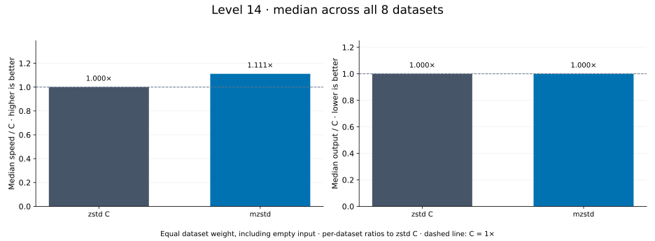
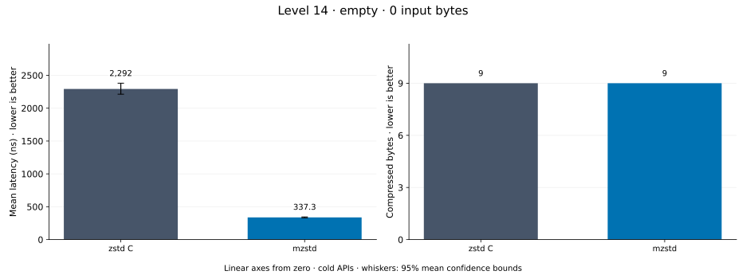
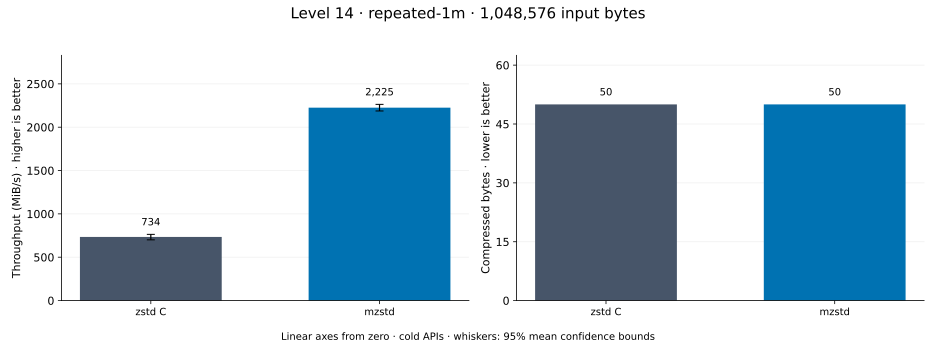
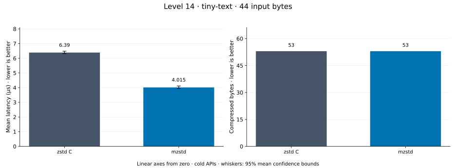
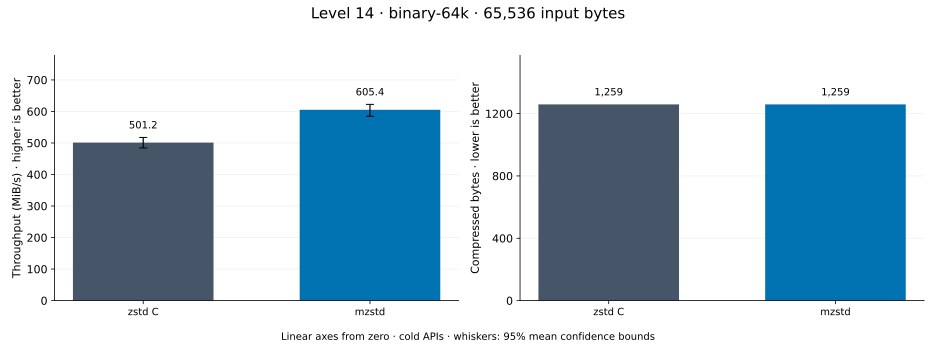
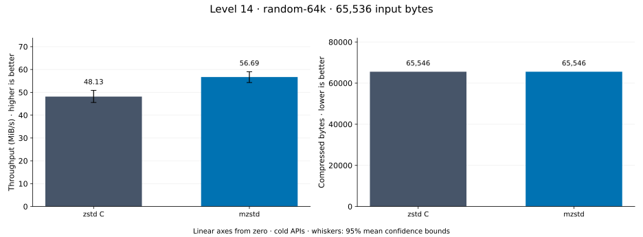
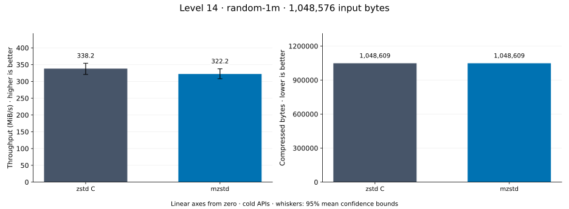
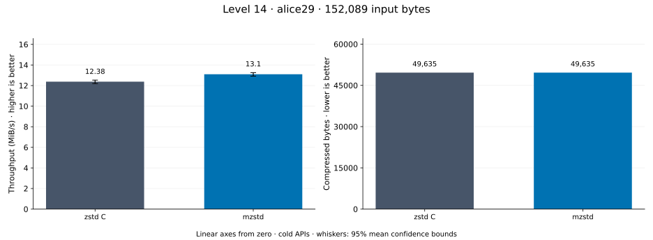
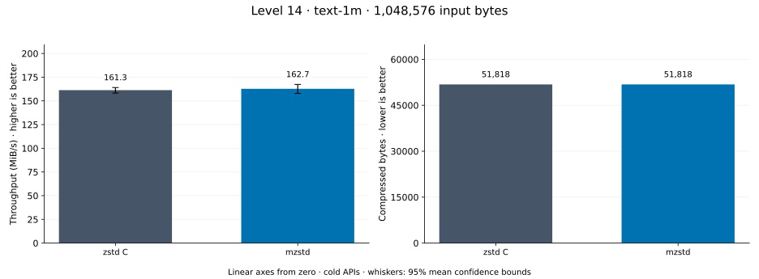

# Compression level 14

[Benchmark index](../README.md) · [Median overview](README.md) · [← Level 13](l13.md) · [Level 15 →](l15.md)

Recorded run: **long-20261112** (2026-11-12).
[Raw results](../encoder-comparison.csv) · [Environment](../encoder-comparison-environment.json) · [Run analysis](../encoder-comparison.md).

## Median across all datasets

Each of the 8 datasets has equal weight, including empty and tiny input.
Speed / C = C mean latency / implementation mean latency; output / C = implementation bytes / C bytes.
We take the median of these 8 per-dataset ratios separately for speed and size.
1× matches C; higher speed and lower output are better. These are medians across datasets,
not median sample latencies, and do not imply statistical significance.

| Implementation | Median speed / C ↑ | Median output / C ↓ | Datasets |
| --- | ---: | ---: | ---: |
| zstd C | 1.000× | 1.000× | 8 |
| mzstd | 1.193× | 1.000× | 8 |

Measurement setup and interpretation

zstd 1.5.7 (the C library built by `zstd-ffi`) and mzstd at the recorded
working tree compress identical bytes at this level. Every frame was checked byte-identical
to zstd's and decoded back to its input before any timing.

These are cold native API measurements: construction, allocation, compression, and disposal.
Complete known input; 50 samples, 3 s warmup, at least 6 s measurement.
Host: AMD Ryzen 9 7950X, Linux KVM guest with two vCPUs: the encoder suite, then the decoder suite, each in one Criterion process pinned to vCPU 1; nothing CPU-heavy ran beside them in the guest. Other tenants load the host, so sampling is lengthened (50 samples of 6 s after a 3 s warmup) to average over the noise. unset; Cargo release defaults (bench profile), runtime SIMD dispatch (AVX-512 level on this host; the decoder runs its block loops at the AVX2 level).

Chart whiskers and table intervals describe 95% confidence bounds on mean timing.
They do not capture all host or allocator variation. Throughput bounds are transformed latency bounds.
Output / input is compressed bytes divided by input bytes; smaller is better, and values above 100% mean expansion.
For empty input, throughput and output / input are undefined (—).
See the [run analysis](../encoder-comparison.md#interpretation-limits) for measurement limitations.

## Dataset details

Ordered by mzstd speed / C, highest first; all 8 datasets are shown.
This order uses recorded mean latency, not statistical significance. Bars start at zero.

[empty](#empty) · [repeated-1m](#repeated-1m) · [tiny-text](#tiny-text) · [binary-64k](#binary-64k) · [random-64k](#random-64k) · [random-1m](#random-1m) · [alice29](#alice29) · [text-1m](#text-1m)

### empty

Empty input; measures API overhead. **Input: 0 bytes.**

mzstd speed / C: **6.796×**; output: 9 / 9 bytes.

Exact measurements and confidence bounds

| Implementation | Mean, ns | 95% mean interval, ns | MiB/s | Output bytes | Output / input | Speed / C |
| --- | ---: | ---: | ---: | ---: | ---: | ---: |
| zstd C | 2,292 | 2,213–2,380 | — | 9 | — | 1.000× |
| mzstd | 337.3 | 331.3–344.6 | — | 9 | — | 6.796× |

### repeated-1m

1 MiB of repeated a bytes. **Input: 1,048,576 bytes.**

mzstd speed / C: **3.032×**; output: 50 / 50 bytes.

Exact measurements and confidence bounds

| Implementation | Mean, µs | 95% mean interval, µs | MiB/s | Output bytes | Output / input | Speed / C |
| --- | ---: | ---: | ---: | ---: | ---: | ---: |
| zstd C | 1,362 | 1,309–1,428 | 734.01 | 50 | 0.005% | 1.000× |
| mzstd | 449.4 | 441.8–457.2 | 2,225.33 | 50 | 0.005% | 3.032× |

### tiny-text

44-byte quick-brown-fox sentence. **Input: 44 bytes.**

mzstd speed / C: **1.592×**; output: 53 / 53 bytes.

Exact measurements and confidence bounds

| Implementation | Mean, µs | 95% mean interval, µs | MiB/s | Output bytes | Output / input | Speed / C |
| --- | ---: | ---: | ---: | ---: | ---: | ---: |
| zstd C | 6.39 | 6.32–6.483 | 6.57 | 53 | 120.455% | 1.000× |
| mzstd | 4.015 | 3.942–4.115 | 10.45 | 53 | 120.455% | 1.592× |

### binary-64k

64 KiB of structured binary bytes: ((i / 16) XOR i) modulo 256. **Input: 65,536 bytes.**

mzstd speed / C: **1.208×**; output: 1,259 / 1,259 bytes.

Exact measurements and confidence bounds

| Implementation | Mean, µs | 95% mean interval, µs | MiB/s | Output bytes | Output / input | Speed / C |
| --- | ---: | ---: | ---: | ---: | ---: | ---: |
| zstd C | 124.7 | 120.8–129 | 501.20 | 1,259 | 1.921% | 1.000× |
| mzstd | 103.2 | 100.4–106.9 | 605.35 | 1,259 | 1.921% | 1.208× |

### random-64k

64 KiB prefix of the deterministic pseudorandom corpus. **Input: 65,536 bytes.**

mzstd speed / C: **1.178×**; output: 65,546 / 65,546 bytes.

Exact measurements and confidence bounds

| Implementation | Mean, µs | 95% mean interval, µs | MiB/s | Output bytes | Output / input | Speed / C |
| --- | ---: | ---: | ---: | ---: | ---: | ---: |
| zstd C | 1,298 | 1,229–1,372 | 48.13 | 65,546 | 100.015% | 1.000× |
| mzstd | 1,102 | 1,059–1,151 | 56.69 | 65,546 | 100.015% | 1.178× |

### random-1m

1 MiB of deterministic xorshift64 pseudorandom bytes. **Input: 1,048,576 bytes.**

mzstd speed / C: **1.097×**; output: 1,048,609 / 1,048,609 bytes.

Exact measurements and confidence bounds

| Implementation | Mean, µs | 95% mean interval, µs | MiB/s | Output bytes | Output / input | Speed / C |
| --- | ---: | ---: | ---: | ---: | ---: | ---: |
| zstd C | 2,694 | 2,531–2,886 | 371.23 | 1,048,609 | 100.003% | 1.000× |
| mzstd | 2,455 | 2,324–2,594 | 407.36 | 1,048,609 | 100.003% | 1.097× |

### alice29

Alice in Wonderland text from the Canterbury corpus (`testdata/alice29.txt`). **Input: 152,089 bytes.**

mzstd speed / C: **1.058×**; output: 49,635 / 49,635 bytes.

Exact measurements and confidence bounds

| Implementation | Mean, µs | 95% mean interval, µs | MiB/s | Output bytes | Output / input | Speed / C |
| --- | ---: | ---: | ---: | ---: | ---: | ---: |
| zstd C | 1.172e+04 | 1.158e+04–1.189e+04 | 12.38 | 49,635 | 32.635% | 1.000× |
| mzstd | 1.107e+04 | 1.094e+04–1.123e+04 | 13.10 | 49,635 | 32.635% | 1.058× |

### text-1m

Alice text repeated cyclically to 1 MiB. **Input: 1,048,576 bytes.**

mzstd speed / C: **1.009×**; output: 51,818 / 51,818 bytes.

Exact measurements and confidence bounds

| Implementation | Mean, µs | 95% mean interval, µs | MiB/s | Output bytes | Output / input | Speed / C |
| --- | ---: | ---: | ---: | ---: | ---: | ---: |
| zstd C | 6,198 | 6,094–6,320 | 161.33 | 51,818 | 4.942% | 1.000× |
| mzstd | 6,145 | 5,974–6,336 | 162.75 | 51,818 | 4.942% | 1.009× |

