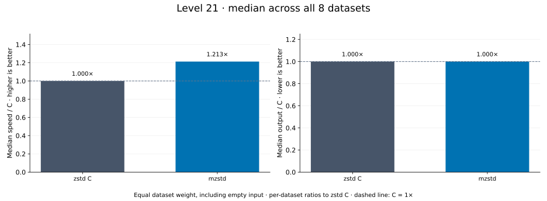
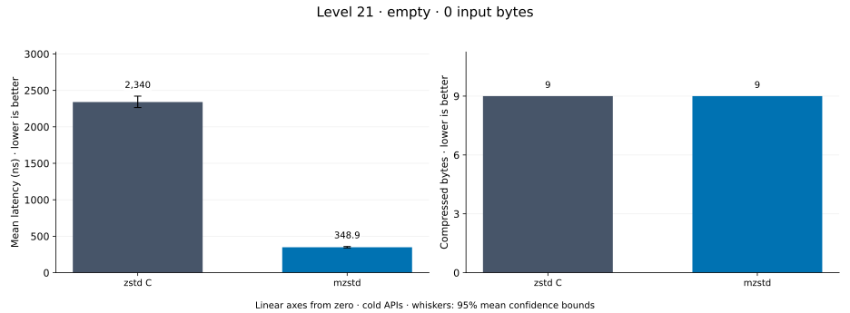
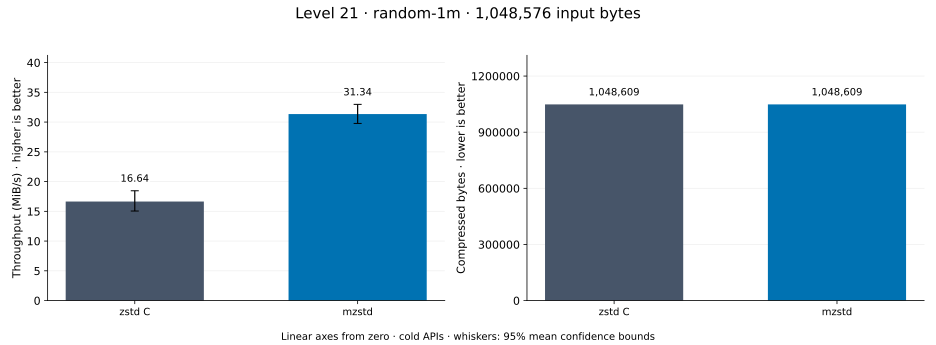
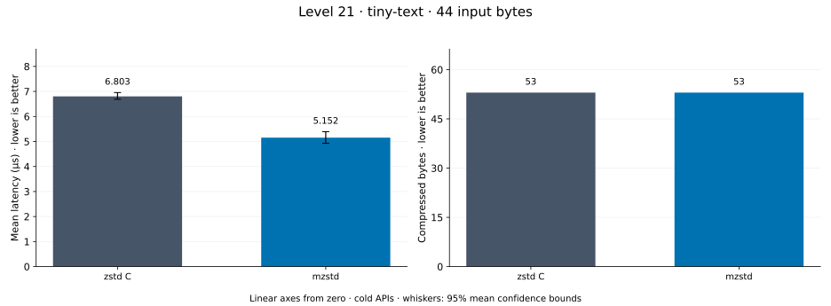
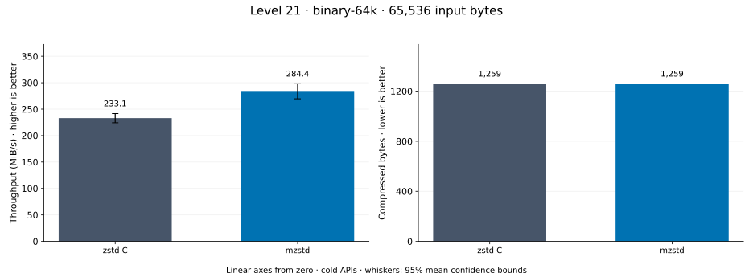
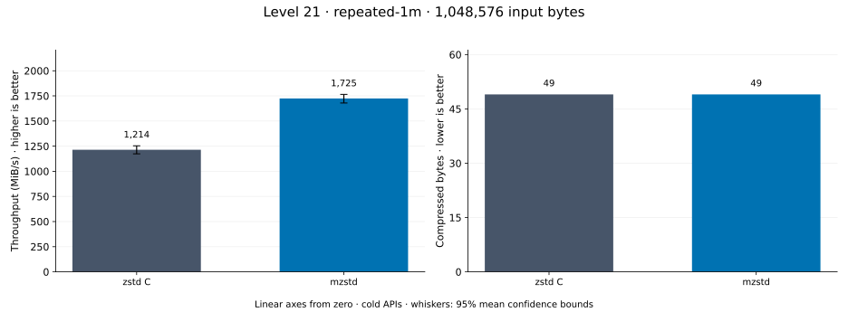
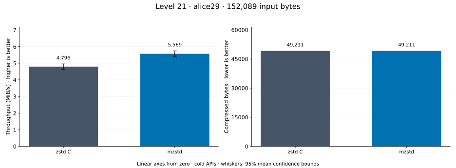
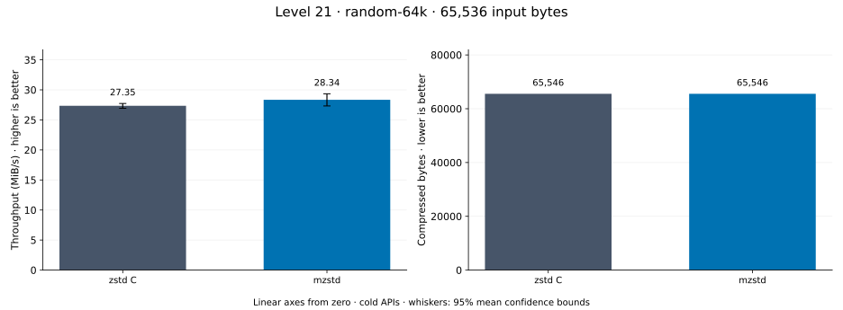
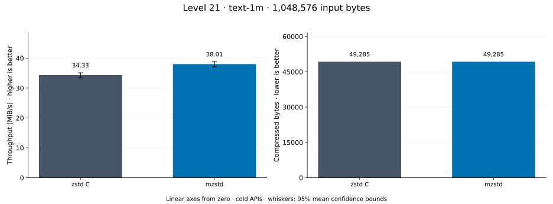

# Compression level 21

[Benchmark index](../README.md) · [Median overview](README.md) · [← Level 20](l20.md) · [Level 22 →](l22.md)

Recorded run: **long-20261109** (2026-11-09).
[Raw results](../encoder-comparison.csv) · [Environment](../encoder-comparison-environment.json) · [Run analysis](../encoder-comparison.md).

## Median across all datasets

Each of the 8 datasets has equal weight, including empty and tiny input.
Speed / C = C mean latency / implementation mean latency; output / C = implementation bytes / C bytes.
We take the median of these 8 per-dataset ratios separately for speed and size.
1× matches C; higher speed and lower output are better. These are medians across datasets,
not median sample latencies, and do not imply statistical significance.

| Implementation | Median speed / C ↑ | Median output / C ↓ | Datasets |
| --- | ---: | ---: | ---: |
| zstd C | 1.000× | 1.000× | 8 |
| mzstd | 1.219× | 1.000× | 8 |

Measurement setup and interpretation

zstd 1.5.7 (the C library built by `zstd-ffi`) and mzstd at the recorded
working tree compress identical bytes at this level. Every frame was checked byte-identical
to zstd's and decoded back to its input before any timing.

These are cold native API measurements: construction, allocation, compression, and disposal.
Complete known input; 50 samples, 3 s warmup, at least 6 s measurement.
Host: AMD Ryzen 9 7950X, Linux KVM guest with two vCPUs: the encoder suite, then the decoder suite, each in one Criterion process pinned to vCPU 1; nothing else ran in the guest. Other tenants loaded the host: a fixed C decode varied by 8-43% (p10-p90 wall time) through the day, so sampling was lengthened to average over the noise. unset; Cargo release defaults (bench profile), runtime SIMD dispatch (AVX-512 level on this host; the decoder runs its block loops at the AVX2 level).

Chart whiskers and table intervals describe 95% confidence bounds on mean timing.
They do not capture all host or allocator variation. Throughput bounds are transformed latency bounds.
Output / input is compressed bytes divided by input bytes; smaller is better, and values above 100% mean expansion.
For empty input, throughput and output / input are undefined (—).
See the [run analysis](../encoder-comparison.md#interpretation-limits) for measurement limitations.

## Dataset details

Ordered by mzstd speed / C, highest first; all 8 datasets are shown.
This order uses recorded mean latency, not statistical significance. Bars start at zero.

[empty](#empty) · [random-1m](#random-1m) · [tiny-text](#tiny-text) · [binary-64k](#binary-64k) · [repeated-1m](#repeated-1m) · [alice29](#alice29) · [random-64k](#random-64k) · [text-1m](#text-1m)

### empty

Empty input; measures API overhead. **Input: 0 bytes.**

mzstd speed / C: **5.362×**; output: 9 / 9 bytes.

Exact measurements and confidence bounds

| Implementation | Mean, ns | 95% mean interval, ns | MiB/s | Output bytes | Output / input | Speed / C |
| --- | ---: | ---: | ---: | ---: | ---: | ---: |
| zstd C | 2,256 | 2,207–2,312 | — | 9 | — | 1.000× |
| mzstd | 420.7 | 405.3–437.7 | — | 9 | — | 5.362× |

### random-1m

1 MiB of deterministic xorshift64 pseudorandom bytes. **Input: 1,048,576 bytes.**

mzstd speed / C: **1.883×**; output: 1,048,609 / 1,048,609 bytes.

Exact measurements and confidence bounds

| Implementation | Mean, µs | 95% mean interval, µs | MiB/s | Output bytes | Output / input | Speed / C |
| --- | ---: | ---: | ---: | ---: | ---: | ---: |
| zstd C | 6.008e+04 | 5.417e+04–6.646e+04 | 16.64 | 1,048,609 | 100.003% | 1.000× |
| mzstd | 3.19e+04 | 3.032e+04–3.359e+04 | 31.34 | 1,048,609 | 100.003% | 1.883× |

### tiny-text

44-byte quick-brown-fox sentence. **Input: 44 bytes.**

mzstd speed / C: **1.561×**; output: 53 / 53 bytes.

Exact measurements and confidence bounds

| Implementation | Mean, µs | 95% mean interval, µs | MiB/s | Output bytes | Output / input | Speed / C |
| --- | ---: | ---: | ---: | ---: | ---: | ---: |
| zstd C | 7.964 | 7.69–8.237 | 5.27 | 53 | 120.455% | 1.000× |
| mzstd | 5.101 | 4.871–5.349 | 8.23 | 53 | 120.455% | 1.561× |

### binary-64k

64 KiB of structured binary bytes: ((i / 16) XOR i) modulo 256. **Input: 65,536 bytes.**

mzstd speed / C: **1.220×**; output: 1,259 / 1,259 bytes.

Exact measurements and confidence bounds

| Implementation | Mean, µs | 95% mean interval, µs | MiB/s | Output bytes | Output / input | Speed / C |
| --- | ---: | ---: | ---: | ---: | ---: | ---: |
| zstd C | 268.2 | 258.7–278.7 | 233.06 | 1,259 | 1.921% | 1.000× |
| mzstd | 219.8 | 209.7–231.8 | 284.38 | 1,259 | 1.921% | 1.220× |

### repeated-1m

1 MiB of repeated a bytes. **Input: 1,048,576 bytes.**

mzstd speed / C: **1.218×**; output: 49 / 49 bytes.

Exact measurements and confidence bounds

| Implementation | Mean, µs | 95% mean interval, µs | MiB/s | Output bytes | Output / input | Speed / C |
| --- | ---: | ---: | ---: | ---: | ---: | ---: |
| zstd C | 861.2 | 832.1–892 | 1,161.15 | 49 | 0.005% | 1.000× |
| mzstd | 707.2 | 669–750.7 | 1,413.98 | 49 | 0.005% | 1.218× |

### alice29

Alice in Wonderland text from the Canterbury corpus (`testdata/alice29.txt`). **Input: 152,089 bytes.**

mzstd speed / C: **1.161×**; output: 49,211 / 49,211 bytes.

Exact measurements and confidence bounds

| Implementation | Mean, µs | 95% mean interval, µs | MiB/s | Output bytes | Output / input | Speed / C |
| --- | ---: | ---: | ---: | ---: | ---: | ---: |
| zstd C | 3.024e+04 | 2.924e+04–3.128e+04 | 4.80 | 49,211 | 32.357% | 1.000× |
| mzstd | 2.605e+04 | 2.524e+04–2.694e+04 | 5.57 | 49,211 | 32.357% | 1.161× |

### random-64k

64 KiB prefix of the deterministic pseudorandom corpus. **Input: 65,536 bytes.**

mzstd speed / C: **1.119×**; output: 65,546 / 65,546 bytes.

Exact measurements and confidence bounds

| Implementation | Mean, µs | 95% mean interval, µs | MiB/s | Output bytes | Output / input | Speed / C |
| --- | ---: | ---: | ---: | ---: | ---: | ---: |
| zstd C | 2,635 | 2,523–2,752 | 23.72 | 65,546 | 100.015% | 1.000× |
| mzstd | 2,355 | 2,258–2,459 | 26.54 | 65,546 | 100.015% | 1.119× |

### text-1m

Alice text repeated cyclically to 1 MiB. **Input: 1,048,576 bytes.**

mzstd speed / C: **1.080×**; output: 49,285 / 49,285 bytes.

Exact measurements and confidence bounds

| Implementation | Mean, µs | 95% mean interval, µs | MiB/s | Output bytes | Output / input | Speed / C |
| --- | ---: | ---: | ---: | ---: | ---: | ---: |
| zstd C | 2.894e+04 | 2.835e+04–2.96e+04 | 34.55 | 49,285 | 4.700% | 1.000× |
| mzstd | 2.68e+04 | 2.598e+04–2.77e+04 | 37.32 | 49,285 | 4.700% | 1.080× |

