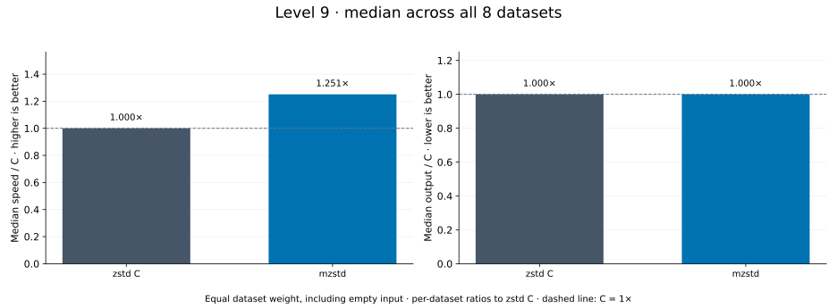
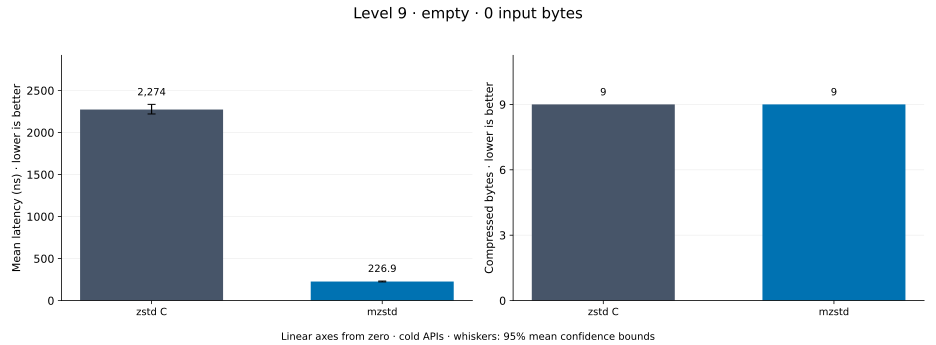
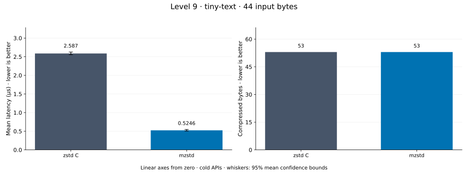
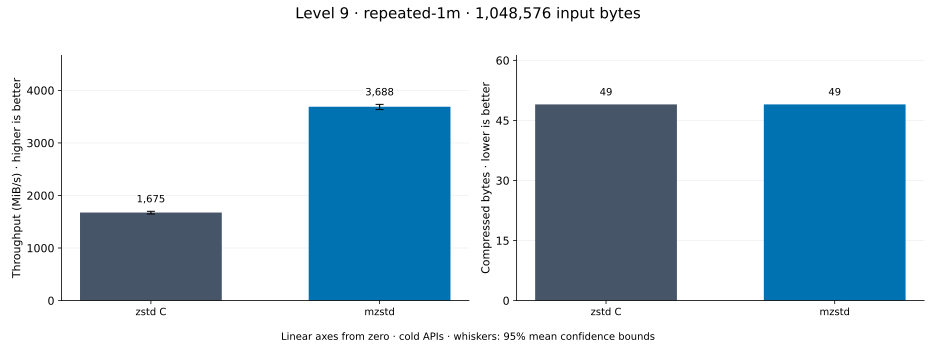
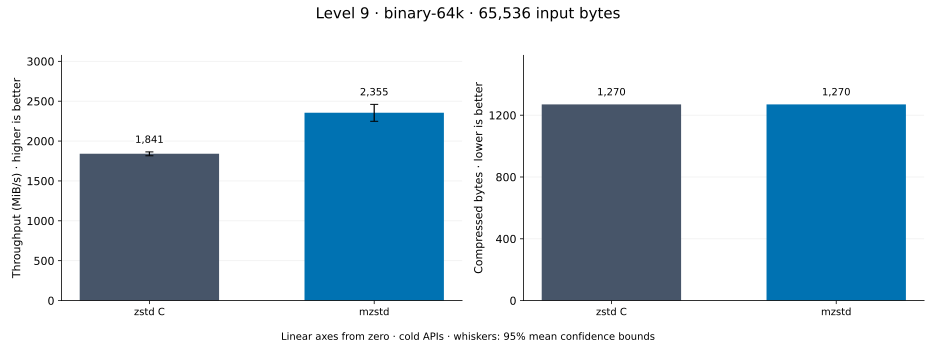
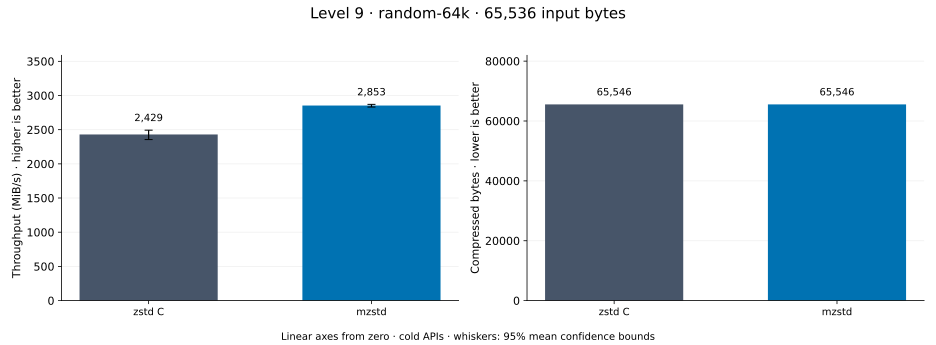
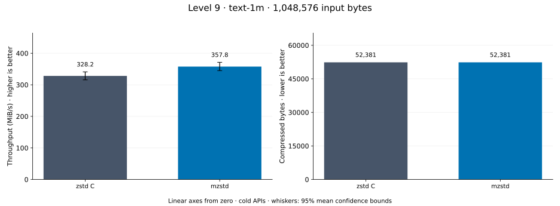
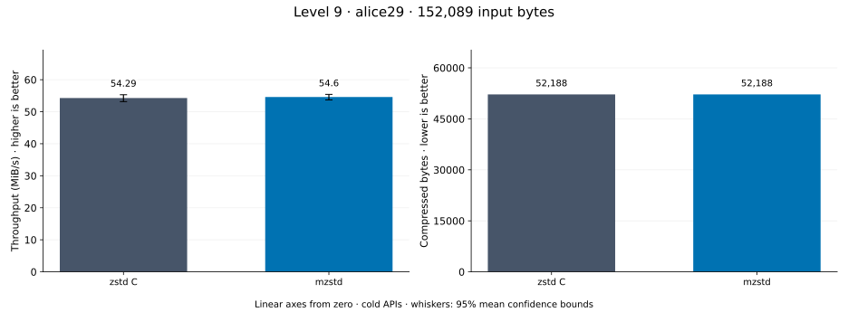

# Compression level 9

[Benchmark index](../README.md) · [Median overview](README.md) · [← Level 8](l8.md) · [Level 10 →](l10.md)

Recorded run: **long-20261109** (2026-11-09).
[Raw results](../encoder-comparison.csv) · [Environment](../encoder-comparison-environment.json) · [Run analysis](../encoder-comparison.md).

## Median across all datasets

Each of the 8 datasets has equal weight, including empty and tiny input.
Speed / C = C mean latency / implementation mean latency; output / C = implementation bytes / C bytes.
We take the median of these 8 per-dataset ratios separately for speed and size.
1× matches C; higher speed and lower output are better. These are medians across datasets,
not median sample latencies, and do not imply statistical significance.

| Implementation | Median speed / C ↑ | Median output / C ↓ | Datasets |
| --- | ---: | ---: | ---: |
| zstd C | 1.000× | 1.000× | 8 |
| mzstd | 1.266× | 1.000× | 8 |

Measurement setup and interpretation

zstd 1.5.7 (the C library built by `zstd-ffi`) and mzstd at the recorded
working tree compress identical bytes at this level. Every frame was checked byte-identical
to zstd's and decoded back to its input before any timing.

These are cold native API measurements: construction, allocation, compression, and disposal.
Complete known input; 50 samples, 3 s warmup, at least 6 s measurement.
Host: AMD Ryzen 9 7950X, Linux KVM guest with two vCPUs: the encoder suite, then the decoder suite, each in one Criterion process pinned to vCPU 1; nothing else ran in the guest. Other tenants loaded the host: a fixed C decode varied by 8-43% (p10-p90 wall time) through the day, so sampling was lengthened to average over the noise. unset; Cargo release defaults (bench profile), runtime SIMD dispatch (AVX-512 level on this host; the decoder runs its block loops at the AVX2 level).

Chart whiskers and table intervals describe 95% confidence bounds on mean timing.
They do not capture all host or allocator variation. Throughput bounds are transformed latency bounds.
Output / input is compressed bytes divided by input bytes; smaller is better, and values above 100% mean expansion.
For empty input, throughput and output / input are undefined (—).
See the [run analysis](../encoder-comparison.md#interpretation-limits) for measurement limitations.

## Dataset details

Ordered by mzstd speed / C, highest first; all 8 datasets are shown.
This order uses recorded mean latency, not statistical significance. Bars start at zero.

[empty](#empty) · [tiny-text](#tiny-text) · [repeated-1m](#repeated-1m) · [binary-64k](#binary-64k) · [random-64k](#random-64k) · [random-1m](#random-1m) · [text-1m](#text-1m) · [alice29](#alice29)

### empty

Empty input; measures API overhead. **Input: 0 bytes.**

mzstd speed / C: **10.021×**; output: 9 / 9 bytes.

Exact measurements and confidence bounds

| Implementation | Mean, ns | 95% mean interval, ns | MiB/s | Output bytes | Output / input | Speed / C |
| --- | ---: | ---: | ---: | ---: | ---: | ---: |
| zstd C | 2,274 | 2,221–2,335 | — | 9 | — | 1.000× |
| mzstd | 226.9 | 221.9–232.8 | — | 9 | — | 10.021× |

### tiny-text

44-byte quick-brown-fox sentence. **Input: 44 bytes.**

mzstd speed / C: **5.109×**; output: 53 / 53 bytes.

Exact measurements and confidence bounds

| Implementation | Mean, µs | 95% mean interval, µs | MiB/s | Output bytes | Output / input | Speed / C |
| --- | ---: | ---: | ---: | ---: | ---: | ---: |
| zstd C | 2.623 | 2.574–2.68 | 16.00 | 53 | 120.455% | 1.000× |
| mzstd | 0.5134 | 0.4936–0.536 | 81.73 | 53 | 120.455% | 5.109× |

### repeated-1m

1 MiB of repeated a bytes. **Input: 1,048,576 bytes.**

mzstd speed / C: **2.345×**; output: 49 / 49 bytes.

Exact measurements and confidence bounds

| Implementation | Mean, µs | 95% mean interval, µs | MiB/s | Output bytes | Output / input | Speed / C |
| --- | ---: | ---: | ---: | ---: | ---: | ---: |
| zstd C | 622.8 | 603.3–646.9 | 1,605.73 | 49 | 0.005% | 1.000× |
| mzstd | 265.6 | 262.6–269.2 | 3,765.15 | 49 | 0.005% | 2.345× |

### binary-64k

64 KiB of structured binary bytes: ((i / 16) XOR i) modulo 256. **Input: 65,536 bytes.**

mzstd speed / C: **1.279×**; output: 1,270 / 1,270 bytes.

Exact measurements and confidence bounds

| Implementation | Mean, µs | 95% mean interval, µs | MiB/s | Output bytes | Output / input | Speed / C |
| --- | ---: | ---: | ---: | ---: | ---: | ---: |
| zstd C | 33.94 | 33.52–34.43 | 1,841.47 | 1,270 | 1.938% | 1.000× |
| mzstd | 26.53 | 25.41–27.8 | 2,355.46 | 1,270 | 1.938% | 1.279× |

### random-64k

64 KiB prefix of the deterministic pseudorandom corpus. **Input: 65,536 bytes.**

mzstd speed / C: **1.253×**; output: 65,546 / 65,546 bytes.

Exact measurements and confidence bounds

| Implementation | Mean, µs | 95% mean interval, µs | MiB/s | Output bytes | Output / input | Speed / C |
| --- | ---: | ---: | ---: | ---: | ---: | ---: |
| zstd C | 29.45 | 28.34–30.6 | 2,122.31 | 65,546 | 100.015% | 1.000× |
| mzstd | 23.5 | 22.92–24.16 | 2,659.48 | 65,546 | 100.015% | 1.253× |

### random-1m

1 MiB of deterministic xorshift64 pseudorandom bytes. **Input: 1,048,576 bytes.**

mzstd speed / C: **1.102×**; output: 1,048,609 / 1,048,609 bytes.

Exact measurements and confidence bounds

| Implementation | Mean, µs | 95% mean interval, µs | MiB/s | Output bytes | Output / input | Speed / C |
| --- | ---: | ---: | ---: | ---: | ---: | ---: |
| zstd C | 529.5 | 515–543.5 | 1,888.72 | 1,048,609 | 100.003% | 1.000× |
| mzstd | 480.3 | 464.3–496 | 2,081.86 | 1,048,609 | 100.003% | 1.102× |

### text-1m

Alice text repeated cyclically to 1 MiB. **Input: 1,048,576 bytes.**

mzstd speed / C: **1.090×**; output: 52,381 / 52,381 bytes.

Exact measurements and confidence bounds

| Implementation | Mean, µs | 95% mean interval, µs | MiB/s | Output bytes | Output / input | Speed / C |
| --- | ---: | ---: | ---: | ---: | ---: | ---: |
| zstd C | 3,047 | 2,932–3,166 | 328.23 | 52,381 | 4.995% | 1.000× |
| mzstd | 2,795 | 2,694–2,898 | 357.78 | 52,381 | 4.995% | 1.090× |

### alice29

Alice in Wonderland text from the Canterbury corpus (`testdata/alice29.txt`). **Input: 152,089 bytes.**

mzstd speed / C: **1.006×**; output: 52,188 / 52,188 bytes.

Exact measurements and confidence bounds

| Implementation | Mean, µs | 95% mean interval, µs | MiB/s | Output bytes | Output / input | Speed / C |
| --- | ---: | ---: | ---: | ---: | ---: | ---: |
| zstd C | 2,672 | 2,623–2,729 | 54.29 | 52,188 | 34.314% | 1.000× |
| mzstd | 2,657 | 2,617–2,702 | 54.60 | 52,188 | 34.314% | 1.006× |

